# Exploration Stage

Before settling on Bounded Wythoff, we spent roughly three weeks (mid-June to early July 2026)
searching for the right game to study. This document records that stage: the framework we built
first, the requirements a candidate had to meet, every game we considered, what its sheets looked
like, and why it did or did not survive.

> ⚠️ marks a rejection reason that was **reconstructed after the fact** from the code, the sheets,
> and memory — it was not written down at the time, so it should be double-checked.

All sheet images below were regenerated from the code in this repo and live in
[images/exploration/](images/exploration/). As everywhere else in the project, a sheet fixes the
level $x$ and renders the $(y,z)$ plane as a boolean grid: black = marked, $(0,0)$ at the bottom
left, $y$ across, $z$ up. $W_x$ is the **instant-winner** sheet (positions with a winning move that
lowers $x$), $L_x$ is the **loser** sheet (P-positions).

## 1. Background: the sheet framework

The project follows the renormalization approach of Friedman & Landsberg: instead of tracing
individual lines of play, we generate entire 2D slices ("sheets") of a 3-coordinate game and study
their geometry — slopes, densities, and how the pattern evolves as the level $x$ grows.

The machinery (see [epic_plan.md](../epic_plan.md)) is the same for every game:

1. **Recursive operator $\mathcal{R}$** — every loser on a lower sheet casts a *shadow* upward:
   the set of higher positions that can jump onto it with one $x$-lowering move (its "parents").
   $W_x$ is the union of all shadows that reach level $x$, maintained cheaply with accumulator /
   auxiliary sheets.
2. **Supermex operator $\mathcal{M}$** — recovers $L_x$ from $W_x$ by resolving the moves that stay
   inside the sheet: scan the grid in lexicographic order, take the first unblocked cell as a
   loser, block everything that can reach it, repeat.

We first built and calibrated this pipeline on games whose answers are known:

- **3-heap Nim** ([Nim/faster_nim_start.py](../Nim/faster_nim_start.py)) — losers are
  $x \oplus y \oplus z = 0$; supermex blocks rows. The W sheets are the XOR "staircase of blocks",
  the L sheets its broken diagonals.
- **3-row Chomp** ([Chomp/faster_chomp_start.py](../Chomp/faster_chomp_start.py)) — Zeilberger's
  column-height coordinates; supermex blocks anti-diagonals $z+y$, and the recurrence adds a
  boundary diagonal then left-shifts. Losers cluster near the origin.
- **Nim + "same amount from all three piles"**
  ([nim_variant/nim_variant_start.py](../nim_variant/nim_variant_start.py)) — our first game with
  two accumulator terms ($A_x$ for straight-down shadows, $B_x$ for the diagonal move). A nice
  sanity result: the extra move changes $W_x$ but **not** $L_x$ — we verified numerically that its
  loser sheets are pixel-identical to plain Nim's (the diagonal move never connects two XOR-zero
  triples with three piles).
- **Diet Chomp** ([chomp_variant/diet_chomp_start.py](../chomp_variant/diet_chomp_start.py),
  notes in [diet_chomp.md](../chomp_variant/diet_chomp.md)) — Chomp with at most 4 squares per
  bite. Bounded moves mean $W_x$ only depends on $L_{x-1},\dots,L_{x-4}$ (a sliding history
  buffer). Its sheets settle into a strictly periodic texture.
- **Chomp + remove a full height-3 column**
  ([chomp_variant/chomp_variant.py](../chomp_variant/chomp_variant.py)) — a one-extra-move probe of
  the Chomp recurrence; sheets stay Chomp-like (losers near the origin).

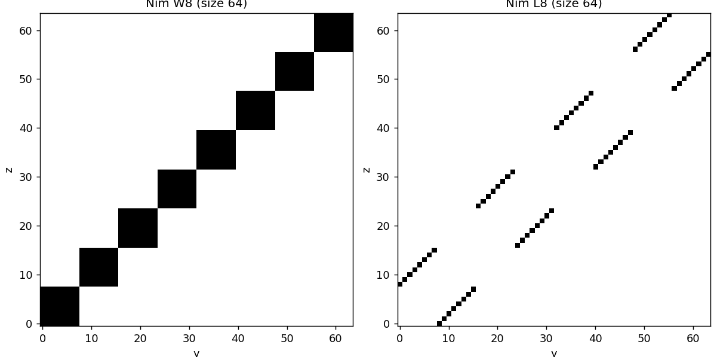
*Nim: $W_8$ and $L_8$. The block staircase and broken-diagonal XOR geometry.*

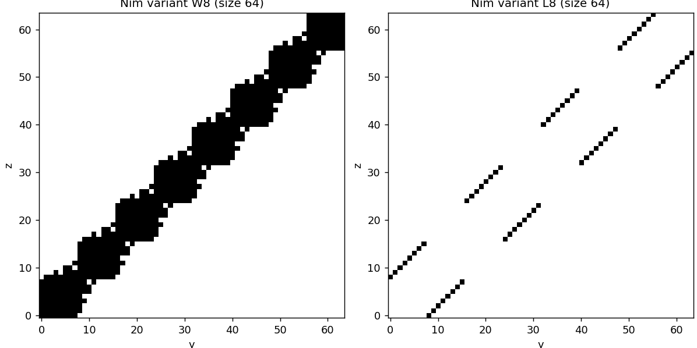
*Nim variant: $W_8$ gains a diagonal fringe from the all-piles move, but $L_8$ is identical to Nim's.*

*Chomp: $W_{12}$ and $L_{12}$ — losers are a handful of cells hugging the origin.*

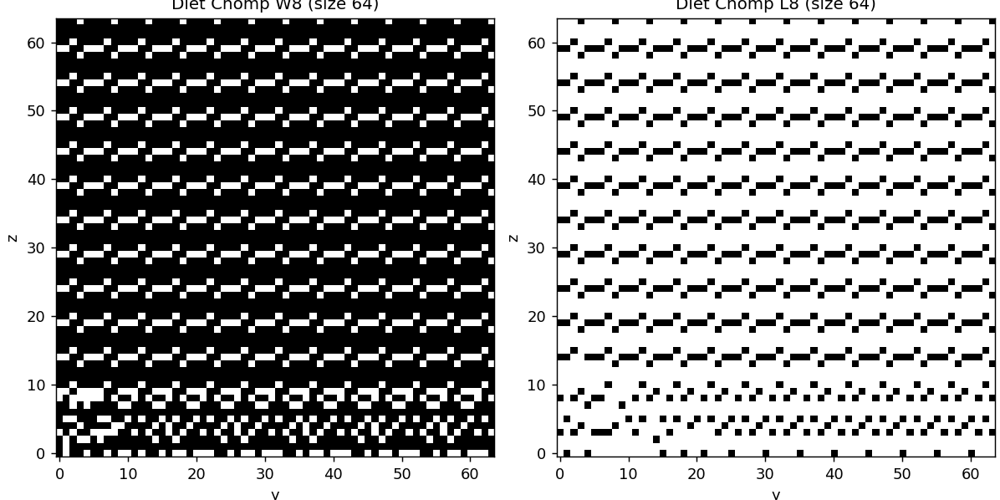
*Diet Chomp: $W_8$ and $L_8$ lock into a periodic lattice — bounded bites make the game eventually periodic.*

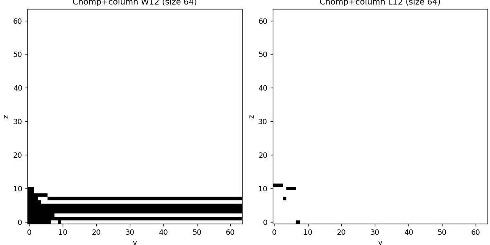
*Chomp + column move: still Chomp-shaped.*

## 2. What we required of a candidate

From [game_ideas.md](../game_ideas.md), every candidate had to be:

- **Impartial** — both players have the same moves;
- representable by **three nonnegative integers** $(x,y,z)$;
- with every move **strictly decreasing the position in lexicographic order** — this is what makes
  the sheet decomposition work: moves split cleanly into inter-sheet (lower $x$) and intra-sheet
  (fix $x$), and the recursion terminates.

During the exploration two further criteria emerged (⚠️ this list is a hindsight reconstruction):

1. **Not already solved** and not trivially reducible to known theory — an XOR-style formula ends
   the story before it starts.
2. **Sheets with structure worth renormalizing** — visible lines with slopes and densities. Both
   failure modes showed up in practice: *degenerate* sheets (losers collapse to axes, single dots,
   or fill everything) and *pure noise* (arithmetic scatter with no macroscopic geometry).
3. **A tractable recursion** — the move's shadow must be expressible with shift/accumulator
   operators so big grids stay $O(N^3)$; moves whose reach depends multiplicatively on the current
   coordinates (gcd, lcm, multiples) resist this.
4. Ideally an **exactly solvable base sheet** $L_0$ to anchor the analysis.

## 3. The candidates

### 3.1 Two-heap Fibonacci Nim

Two piles plus a memory coordinate: $(x, y, z)$ = pile 1, pile 2, and the number of chips taken on
the previous move; a move takes $1 \le t \le 2z$ from either pile and sets $z = t$.
Implemented in [fibonacci_nim/fibonacci_nim_start.py](../fibonacci_nim/fibonacci_nim_start.py).

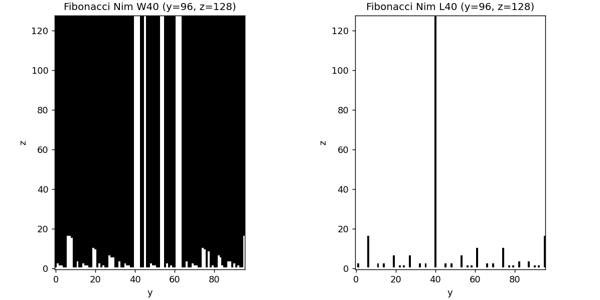
*$W_{40}$ and $L_{40}$ on a $96 \times 128$ grid. Nearly everything is a winner; losers are pinned
to the bottom edge, plus the full column $y = x$ (equal piles lose by the mirroring strategy —
whatever $t$ the opponent takes from one pile, taking the same $t$ from the other is always legal).*

The third coordinate is *move memory*, not a pile, and it dominates the mechanics: correctness
requires $z_{\text{size}} > \max(x, y)$ (silent truncation otherwise — see the docstring), forcing
rectangular grids, and the sheets are thin bars rather than 2D geometry. ⚠️ Dropped because the
state space is not a true 3-heap position space and the sheets carry almost no structure to
renormalize.

### 3.2 Three-heap Subtract a Square

Nim moves restricted to square amounts: $(x,y,z) \to (x-t,y,z)$ etc. with $t$ a perfect square
(the multi-pile variants from game_ideas.md were never needed). Implemented in
[subtract_a_square/subtract_a_square_start.py](../subtract_a_square/subtract_a_square_start.py).

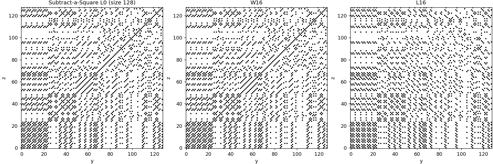
*$L_0$, $W_{16}$, $L_{16}$ at size 128: dense quasi-random arithmetic scatter at every level.*

The sheets are beautiful number-theoretic noise — no lines, no densities settling down, nothing
macroscopic for the renormalization lens to grab. ⚠️ Dropped for that reason (and the 1-pile game
is classical Sprague–Grundy territory, so the independent-piles version is already "solved" via
XOR of Grundy values).

### 3.3 Three-heap Subtract a Prime

Same family with $t$ prime. Never implemented — ⚠️ the subtract-a-square sheets already showed
what arithmetic move sets do to the geometry.

### 3.4 Nim with merging piles

Nim plus "merge two piles into one." Never implemented: merging *raises* a coordinate, which
breaks the strict lexicographic-decrease requirement — the sheet recursion (and termination)
doesn't apply. Dropped at the requirements stage.

### 3.5 Three-heap Impartial Euclid's Game

A move subtracts a positive multiple of one pile from another pile:
$(x,y,z) \to (x - ky, y, z)$, $(x, y - kz, z)$, etc.
Implemented in [euclids_game/euclids_game_start.py](../euclids_game/euclids_game_start.py).

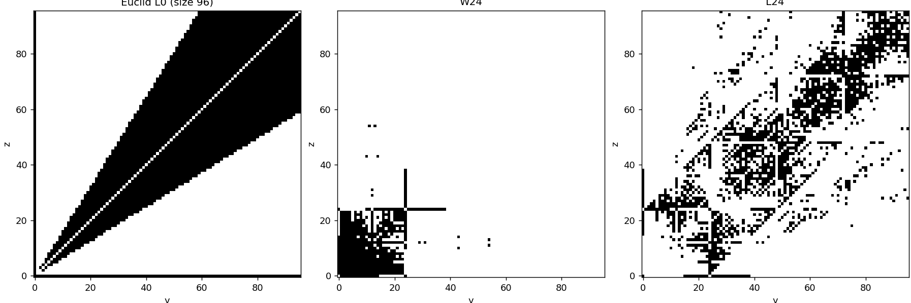
*$L_0$ (size 96), $W_{24}$, $L_{24}$. The base sheet is the classical 2-pile Euclid wedge — losers
fill $1/\varphi < z/y < \varphi$ (white diagonal: equal piles win immediately). Above it the
structure disintegrates into chaotic blotches.*

The base sheet is lovely and known (golden-ratio wedge), but higher sheets show patchy chaos with
no stable lines, and the move reach $k \cdot (\text{pile})$ depends multiplicatively on the current
coordinates, so no shift-invariant accumulator exists. ⚠️ Dropped for both reasons.

### 3.6 Three-heap GCD Game

Pick two piles, subtract any positive multiple of their gcd from the third:
$(x,y,z) \to (x - k\gcd(y,z), y, z)$, etc. Implemented in [gcd/gcd_start.py](../gcd/gcd_start.py).

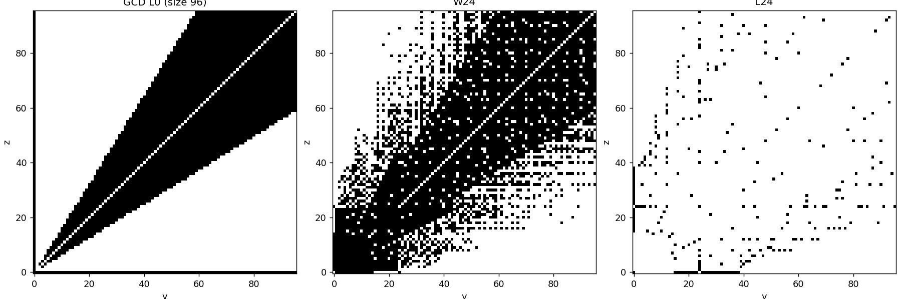
*$L_0$, $W_{24}$, $L_{24}$ at size 96. $L_0$ is **identical to Euclid's** — at $x=0$,
$\gcd(0,n)=n$, so both games degenerate to 2-pile Euclid on the base sheet. Above it: dense chaotic
$W$, sparse scattered $L$.*

Same verdict as Euclid: ⚠️ gcd is wildly non-monotone in the coordinates, the shadows are not
translation-invariant, and the upper sheets are noise. Also, there is so much numer theory stuff going on hence was dropped.

### 3.7 Three-heap LCM-bounded subtraction

Subtract $1 \le t \le \operatorname{lcm}$ of the two untouched piles from a pile.
Implemented in [lcm/lcm_start.py](../lcm/lcm_start.py).

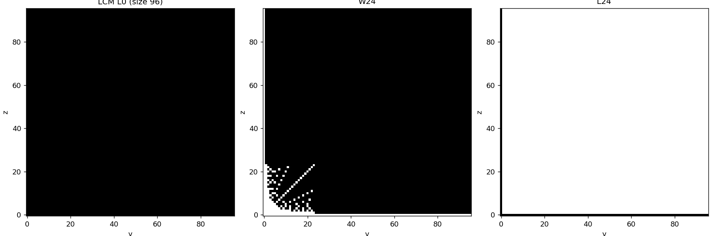
*$L_0$, $W_{24}$, $L_{24}$ at size 96. Degenerate: $\operatorname{lcm}(0,n) = 0$, so the entire
$x=0$ sheet has no moves and is all losers; on higher sheets the losers collapse onto the axes and
$W$ swallows everything else.*

The lcm bound is so generous that interior positions are always winners. Dropped as degenerate —
the sheets say it themselves. Also more number theory inclined

### 3.8 Three-heap Tax Nim

Nim, but the two untouched piles each lose one chip (if non-empty):
$(x,y,z) \to (x-t, \max(0,y-1), \max(0,z-1))$.
Implemented in [nim_variant/tax_nim.py](../nim_variant/tax_nim.py).

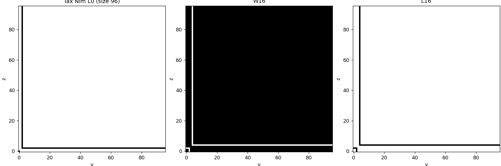
*$L_0$, $W_{16}$, $L_{16}$ at size 96: losers are a thin row-and-column bracket near the axes.*

Recorded at the time in the module docstring: because a move *shifts the other coordinates*, the
clean sheet/supermex shift recurrence does not apply, and the game had to be computed as a direct
3D dynamic program. The sheets came out nearly trivial — losers hug the axes. Dropped on both
counts.

### 3.9 Chomp with Protected Diagonal

Three-row Chomp where a square on the main diagonal may only be chomped if the move removes
exactly that square. Implemented in
[Chomp/protected_diagonal_chomp.py](../Chomp/protected_diagonal_chomp.py) (direct DP, since the
restriction depends on the whole board shape).

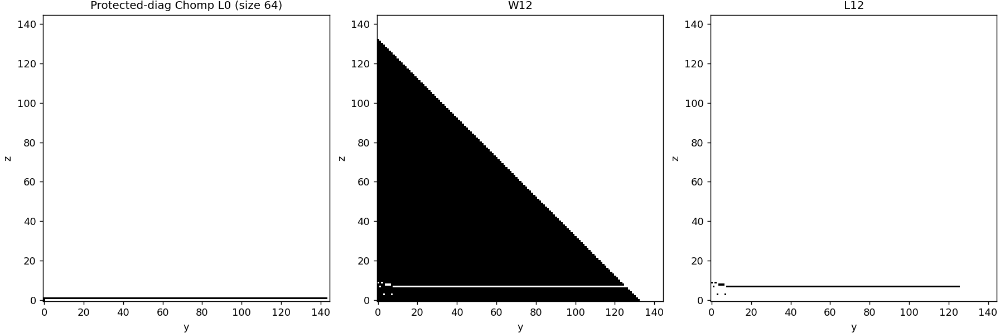
*$L_0$, $W_{12}$, $L_{12}$. $W$ is a filled triangle; each loser sheet is essentially a single
horizontal line with a small cluster near the origin.*

⚠️ Dropped because the geometry stays Chomp-shaped — one loser row per level — so the restriction
adds bookkeeping without adding new sheet structure.

### 3.10 3D Wythoff (1:1 two-pile move) and Combined Wythoff

The stepping stone into the Wythoff family
([wythoffs_game/_3d_wythoff.py](../wythoffs_game/_3d_wythoff.py)): Nim plus "remove the same
number from any two piles." **Combined Wythoff**
([wythoffs_game/wythoff_combined.py](../wythoffs_game/wythoff_combined.py), notes in
[combined.md](../wythoffs_game/combined.md)) adds the three-pile diagonal move; every coupling is
1:1, so the whole recursion is four invariant shifts $\mathcal{I}, \mathcal{Y}, \mathcal{Z},
\mathcal{D}$ — the cleanest recursive operator we ever derived.

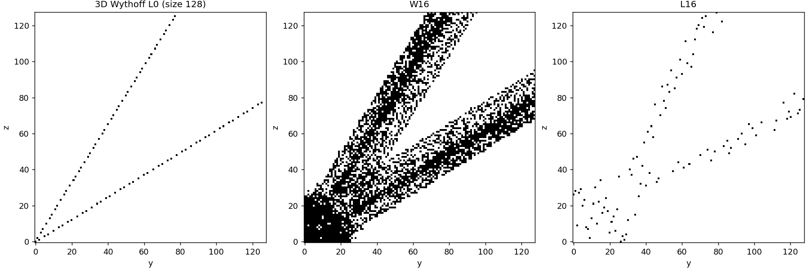
*3D Wythoff: $L_0$ is the exact golden-ratio Beatty pair; $W_{16}$ is two speckled bands; $L_{16}$
is a diffuse scatter around two fattened lines.*

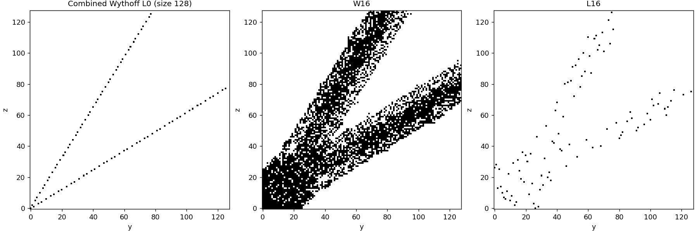
*Combined Wythoff at the same levels — visually almost identical to 3D Wythoff; the three-pile
move barely changes the geometry.*

$L_0$ is exactly 2-pile Wythoff (slopes $\varphi$, $1/\varphi$), but on higher sheets the loser
lines scatter into loose clouds. As noted in [game_ideas.md](../game_ideas.md), the combined game
sits right next to Ryuō Nim, which is solved, and 1:1 3D Wythoff itself is well-trodden
literature. ⚠️ Dropped as too close to known results, with upper-sheet lines too diffuse for
exact analysis.

### 3.11 Unbalanced Wythoff, 1:2 and 1:3

Nim plus a rigidly coupled two-pile move: remove $k$ from one pile and exactly $2k$ (resp. $3k$)
from another. Implemented in
[wythoffs_game/unbalanced_3d_wythoff.py](../wythoffs_game/unbalanced_3d_wythoff.py) and
[unbalanced_3d_wythoff_3.py](../wythoffs_game/unbalanced_3d_wythoff_3.py) (derivation notes in
[unbalanced_3.md](../wythoffs_game/unbalanced_3.md) — the $3k$ version needs a 3-level history
because the move skips intermediate sheets).

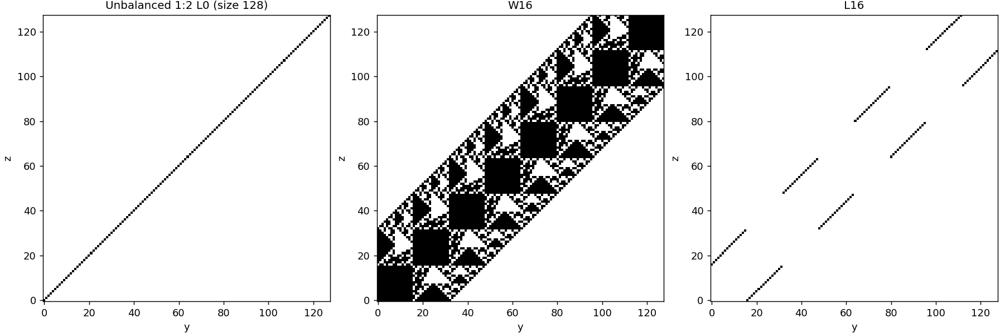
*1:2 — $L_0$ is exactly the diagonal $y=z$ (any imbalance can be equalized, and no coupled move
preserves equality); $W_{16}$ is a striking fractal-looking band of blocks; $L_{16}$ is XOR-like
broken diagonal segments.*

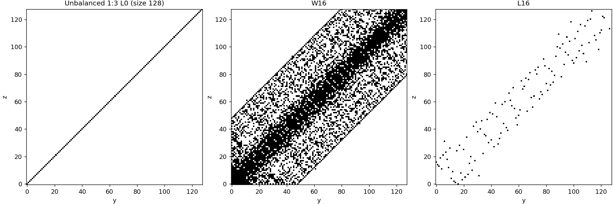
*1:3 — same skeleton, wider and noisier band.*

The 1:2 sheets look *algebraic* — block-periodic segments strongly suggesting a carry/XOR-style
closed form nearby — while the base sheet is a bare diagonal, so there is no interesting
$L_0$ to anchor on. ⚠️ Dropped for those reasons; the fixed ratio also makes the shadow a single
ray rather than a 2D cone, which is what later made Bounded Wythoff (a *range* of ratios) feel
like the right generalization.

### 3.12 Akiyama 3D Wythoff Positive Nim

The very permissive move set (remove from one pile; any amounts from two piles; equal amounts from
two piles plus anything from the third). Implemented in
[wythoffs_game/akiyama_positive.py](../wythoffs_game/akiyama_positive.py); the operator derivation
(prefix-OR "cumulative" shadows, strict vs inclusive) is written up in
[akiyama_algorithm.md](../wythoffs_game/akiyama_algorithm.md) and taught us machinery we reused
later.

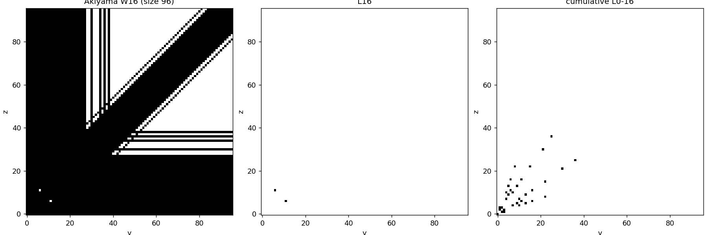
*$W_{16}$, $L_{16}$, and cumulative $L_{0..16}$ at size 96. $W$ covers nearly everything; sheet 16
contains exactly two losers; all losers up to level 16 form one small cluster near the origin.*

With moves this powerful, P-positions almost vanish — each sheet holds a couple of losers in a
staircase collapse near the origin. Nothing to renormalize. ⚠️ Dropped as degenerate, but the
cumulative-loser (C) sheet display and the prefix-OR accumulators built here carried forward.

### 3.13 Step-Size Bounded Nimble

Three coins on a 1D strip; slide a coin left at most $k$ squares, no jumping (rules were briefly
committed on June 29 and later removed; recovered from git history). Coin positions map to pile
sizes, so ⚠️ each coin is just a subtraction game $S = \{1,\dots,k\}$ with Grundy value
$\text{position} \bmod (k+1)$, and the whole game is solved by XOR — dropped as trivially
reducible.

### 3.14 The Moore's Nim detour (Bounded Wythoff variants 1 and 2)

When we converged on "Nim plus a ratio-bounded two-pile move," there were three ways to bound the
second pile's removal against the first's amount $x$ (see [final_games.md](../final_games.md)):

1. **$0$–$x$:** remove $x$ from one pile and $0 \le t \le x$ from a second;
2. **$0$–$2x$:** remove $x$ and $0 \le t \le 2x$;
3. **$x$–$2x$:** remove $x$ and $x \le t \le 2x$ (i.e. ratio between 1:2 and 2:1).

Variants 1 and 2 die by a symmetry argument recorded in final_games.md: since we may freely choose
which pile is "the $x$ pile," pick the one losing more chips — then the constraint on the other
pile is vacuous, and the move becomes "remove anything from any two piles." That is **Moore's
$\text{Nim}_2$**, solved in 1910: a position is losing iff adding the binary representations
without carrying gives $0 \pmod 3$. We implemented the sheet generator
([nim_variant/moores_nim_2.py](../nim_variant/moores_nim_2.py)) and verified it cell-for-cell
against the closed formula ([nim_variant/moore_check.py](../nim_variant/moore_check.py)).

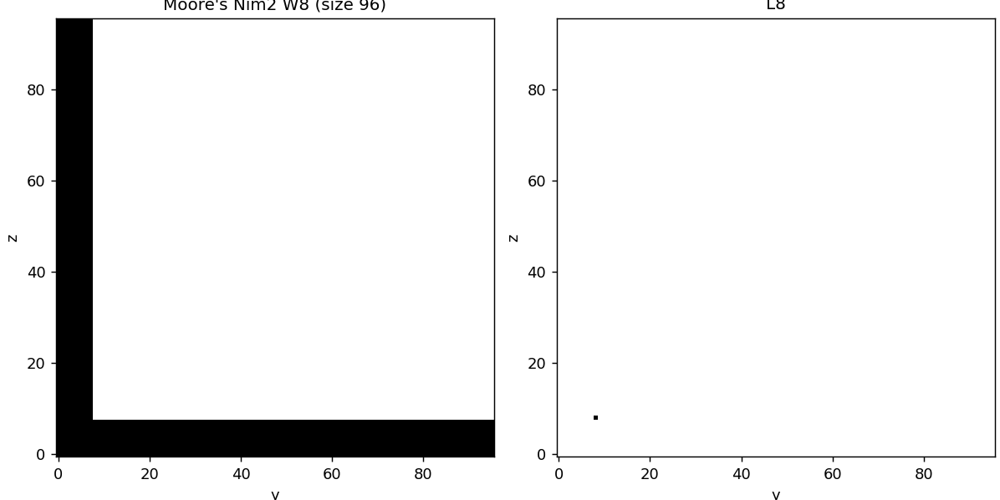
*Moore's $\text{Nim}_2$: $W_8$ is an L-shaped block and $L_8$ is a single dot — a solved game's
sheets have no mysteries.*

### 3.15 The shortlist

[final_games.md](../final_games.md) records the final ranking.

**Maybe — Asymmetric Bounded Nim**
([nim_variant/asymmetric_bounded_nim.py](../nim_variant/asymmetric_bounded_nim.py), notes in
[asymmetric.md](../nim_variant/asymmetric.md)): ordered piles, remove anything from $X$, at most
$x$ from $Y$, at most $y$ from $Z$. Only the $X$ move changes sheets, so the recursion is just a
running union; the in-sheet moves have *fixed-width windows*, giving a slick $O(1)$-per-cell
supermex.

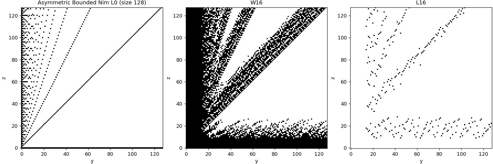
*$L_0$ is a fan: the main diagonal plus a self-similar spray of lines accumulating at the $z$-axis.
$W_{16}$ and $L_{16}$ split into a low horizontal band plus rising fan lines.*

The geometry is striking but ⚠️ the game is asymmetric by construction (the piles are ordered), so
the mirror-symmetry arguments that power the renormalization analysis don't apply, and it was held
as a backup rather than the main game.

**Second best — Restricted Wythoff**
([wythoffs_game/restricted_wythoff.py](../wythoffs_game/restricted_wythoff.py), notes in
[restricted.md](../wythoffs_game/restricted.md)): Nim plus the 1:1 Wythoff move bounded by the
*third, untouched* pile ($t \le z$ for the $X,Y$ move). The bound couples all three coordinates,
which forced a new trick (per-diagonal "most recent loser" trackers) to stay $O(N^3)$.

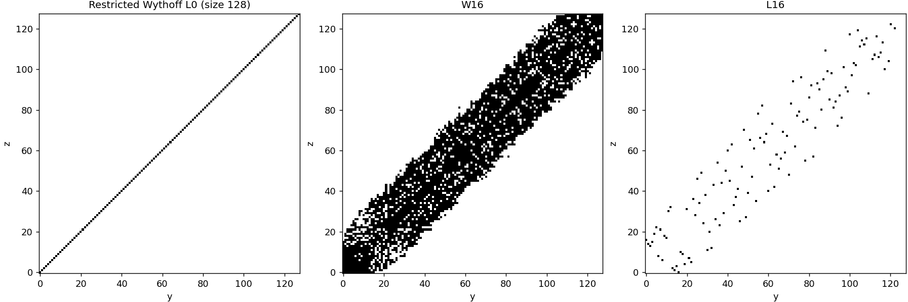
*$L_0$ is the bare diagonal (at $x=0$ the third pile bounds the move by 0, so the sheet is plain
2-pile Nim); $W_{16}$ is a thick diagonal band; $L_{16}$ scatters into several rough parallel
lines.*

⚠️ Ranked second because its base sheet is trivial (no exactly-solvable 2-pile game to anchor on —
the two-pile move vanishes at $x=0$) and its loser lines spread into scatter rather than staying
crisp.

**Most promising — Bounded Wythoff ($x$–$2x$)**
([wythoffs_game/bounded_wythoff.py](../wythoffs_game/bounded_wythoff.py), first coded manually in
[manual_bounded.py](../wythoffs_game/manual_bounded.py)): Nim plus removing $a$ from one pile and
$b$ from another with $\tfrac12 \le a/b \le 2$.

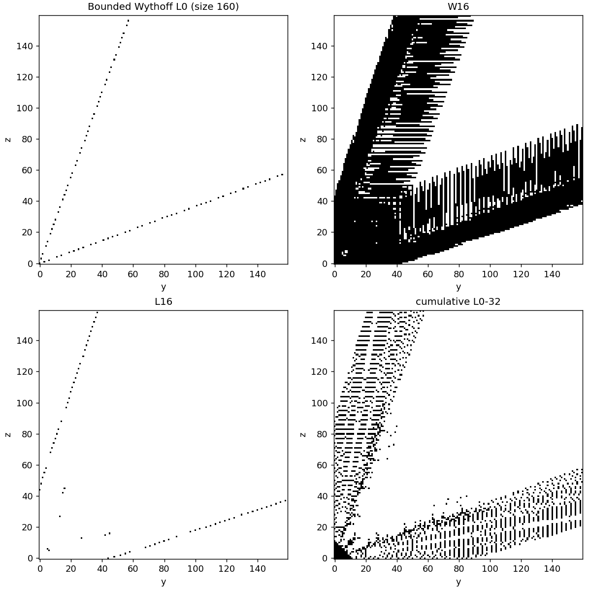
*$L_0$, $W_{16}$, $L_{16}$ at size 160, and cumulative $L_{0..32}$. Two crisp loser lines with
slopes $1+\sqrt3$ and $\frac{\sqrt3 - 1}{2}$, thick cone-shadow bands in $W$, a small chaotic core
near the origin, and cumulative sheets that fill into two dashed fans.*

Everything we'd learned to want is here, and final_games.md records the known-theory positioning:
with two piles this is Fraenkel's $\text{Wyt}(f)$ with $f(k) = 2k+1$ (the $2k+1$ case is only
briefly touched in the literature, arXiv:math/9809074), so the three-pile game is genuinely open.
Concretely:

- an **exactly solvable base sheet** — $L_0$ is the 2-pile game with the mex recurrence
  $b_n = 2a_n + n$ (proved in [bounded.md](../wythoffs_game/bounded.md));
- a **tractable recursion** — the ratio cone has Hilbert basis $\{(1,1),(1,2),(2,1)\}$, so the 2D
  wedge shadow advances one basis step per level and the whole computation stays $O(N^3)$
  (derived in [Part_3.md](Part_3.md));
- **crisp two-line geometry with real depth** — the macroscopic slope/density fixed point solves
  exactly ($m = 1+\sqrt3$), while the microscopic placements stay chaotic through collisions with
  inherited winners: solvable enough to prove things, wild enough to be interesting.

## 4. Deep dive: Bounded Wythoff, the game we settled on

The rest of this document treats Bounded Wythoff as one entry among many. This section pulls it out
and looks closely at the three things that made it different from every other candidate: the exact
shape of its move rule, where that rule sits relative to every other Wythoff-family game we tried,
and what we learned by finally checking the literature before committing to it.

### 4.1 The rules, precisely

Bounded Wythoff is played on three fully interchangeable piles $(x,y,z)$ — no pile is distinguished,
unlike Asymmetric Bounded Nim's ordered piles. Two kinds of moves are legal:

- **Single-pile (ordinary Nim):** remove any positive number of chips from exactly one pile.
- **Two-pile, bounded-ratio move**, on any pair of the three piles: remove $a \ge 1$ from one and
  $b \ge 1$ from the other, subject to

$$\frac12 \le \frac{a}{b} \le 2 \qquad\Longleftrightarrow\qquad a \le 2b \ \text{ and }\ b \le 2a.$$

Concretely: taking 4 chips from one pile lets you take anywhere from 2 through 8 chips from a second
pile in that same move. Taking 0 from the second pile is not a legal *two-pile* move — that's just
the ordinary single-pile move instead, since the two-pile rule always requires $a,b\ge1$.

The cleanest way to see what this rule actually is: fix which two piles a move touches and plot the
legal $(a,b)$ pairs as points in the first quadrant. Classical two-pile Wythoff only allows the
diagonal ray $a=b$ — take equal amounts from both piles. Bounded Wythoff replaces that single ray
with **every integer point in the wedge between the rays $b=2a$ and $b=\tfrac{a}{2}$**. It is exactly
Wythoff's diagonal move, fattened from a ray into a cone of admissible ratios.

### 4.2 Where it sits among every other Wythoff variant we tried

We didn't arrive at this rule directly — it's the point in a family of ratio constraints that the
other Wythoff games we built were also probing. Plotting each game's legal $(a,b)$ region on the
same axes makes the relationship exact instead of just descriptive:

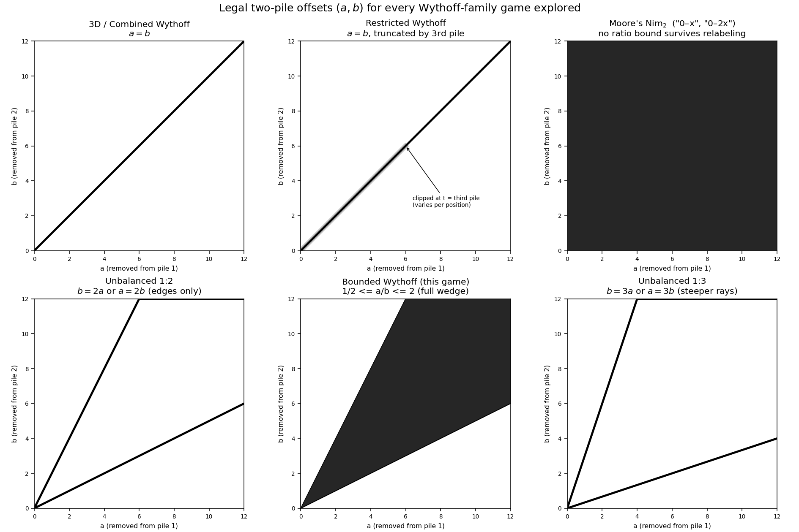
*Every two-pile move rule we implemented, as a region in the $(a,b)$ removal plane. Bounded Wythoff
is literally the interior Unbalanced 1:2 only draws the boundary of, sitting strictly inside the
full quadrant Moore's Nim$_2$ allows.*

| Game | Legal $(a,b)$ | Relationship to Bounded Wythoff's wedge |
|---|---|---|
| 3D / Combined Wythoff | $a=b$ | the wedge's center line (angle bisector) |
| Restricted Wythoff | $a=b$, but $t$ capped by the untouched third pile | the same center ray, clipped by a coordinate outside the $(a,b)$ plane |
| Unbalanced 1:2 | $b=2a$ **or** $a=2b$ | *exactly the two boundary rays of the wedge* — the interior is excluded |
| Unbalanced 1:3 | $b=3a$ **or** $a=3b$ | two rays outside the wedge altogether |
| Moore's Nim$_2$ (bounded variants "0–x", "0–2x") | any $a,b\ge0$ | the wedge's ratio constraint dropped entirely |
| **Bounded Wythoff** | every $(a,b)$ with $\tfrac12\le a/b\le2$ | — |

Two relationships are worth stating outright because they aren't obvious from the rule text alone:

- **Unbalanced 1:2 is Bounded Wythoff's boundary, not its interior.** [game_ideas.md](../game_ideas.md)
  lists both $(x-t,\,y-2t)$ and $(x-2t,\,y-t)$ as legal moves for the unbalanced game — those are
  precisely the two rays $b=2a$ and $b=\tfrac{a}{2}$ that bound our wedge. Bounded Wythoff is what
  you get by filling in every ratio *between* those two rays instead of only allowing the two extremes.
  That's also why Unbalanced 1:2's sheets (§3.11) look block-periodic and almost algebraic — a fixed
  ratio is a much more rigid constraint than a whole window of ratios.
- **Combined/Restricted Wythoff is the wedge collapsed to a single ray.** $a=b$ is the special case
  $a/b=1$, dead center in our cone. Loosening that one ratio into the interval $[\tfrac12,2]$ is
  precisely the generalization step from those games to this one.

### 4.3 Why the "0–x" and "0–2x" bounded variants collapse, and this one doesn't

[final_games.md](../final_games.md) records three ways to bound a two-pile move against the amount
$x$ taken from the first pile: $0\!\le\! t\!\le\! x$, $0\!\le\! t\!\le\! 2x$, and $x\!\le\! t\!\le\! 2x$
(our ratio cone, since $\tfrac12 \le a/b \le 2$ is the same statement as $a \le b \le 2a$ once you
label the smaller removal $a=x$). The first two are not new games at all: because the game is fully
symmetric, a player is always free to relabel which pile they call "the $x$ pile" — so pick whichever
pile you happen to remove *more* from. Once that relabeling is available, "removed at most $x$ (or
$2x$) from the other pile" is automatically true of *every* two-pile removal, since $0$ is always an
allowed lower bound. The ratio constraint evaporates, and the move set becomes "remove any amount from
any two piles" — **Moore's $\text{Nim}_2$**, solved in 1910 (the mod-3 no-carry formula, §3.14). We
confirmed this cell-for-cell against the closed formula in
[nim_variant/moore_check.py](../nim_variant/moore_check.py).

The third variant is the one that survives, and the reason is a single missing degree of freedom:
its lower bound is $t \ge x$, not $t \ge 0$. No relabeling trick makes "the second pile must lose at
least as much as the first" vacuous — whichever pile you call $x$, the other pile is still forced to
give up a comparable amount. That one-sided-vs-two-sided distinction in the bound is the entire reason
this member of the family resisted the same collapse and turned out to be worth pursuing.

### 4.4 Literature review: how we found out it wasn't new (at two piles) or solved (at three)

Once the $x$–$2x$ variant survived the Moore's-Nim collapse argument, we searched for prior work on
ratio-bounded and multi-pile Wythoff generalizations before committing further time to it — we did
not want to spend weeks rediscovering a known result.

That search led to Aviezri Fraenkel's work on generalized two-pile Wythoff games. Fraenkel's
$(s,t)$-Wythoff family generalizes the classical move (take equal amounts from both piles) to: take
$k>0$ from one pile and $\ell \ge k$ from the other, subject to $\ell - k < (s-1)k + t$. Setting
$(s,t)=(2,1)$ turns that bound into exactly $k \le \ell \le 2k$ — our ratio cone, restricted to two
piles. So the base sheet of our game, $x=0$ (pure two-pile play), turned out to already be **known**:
it is Fraenkel's $(2,1)$-Wythoff game, solved in his 1998 paper via the same mex recurrence,
$a_n=\operatorname{mex}\{a_i,b_i:i<n\}$, $b_n=2a_n+n$, that we had derived independently
[F98, Theorem 1] (see [bounded.md](../wythoffs_game/bounded.md), Section 1). We also found
[arXiv:math/9809074](https://arxiv.org/pdf/math/9809074), which briefly touches the equivalent
$f(k)=2k+1$ two-pile case — but, like Fraenkel, stops at two piles.

That base-sheet match was reassuring (our independent derivation was correct) and a little
deflating (the two-pile game wasn't new) — until we found Fraenkel's 2004 follow-up. In its
"Further studies" section, Fraenkel explicitly lists **extending the $(s,t)$-Wythoff family to more
than two piles** as an open problem [F04]. As far as our search found, nobody had carried the
ratio-bounded two-pile move into three or more piles and studied the resulting sheet geometry — that
is exactly our game. The literature review turned Bounded Wythoff from "a rule we made up" into "the
specific open extension a named researcher had already flagged as worth doing."

One more of Fraenkel's results reframed how we read our own findings: for every $s>1$ — which
includes our $(2,1)$ case — the losing sequence of the **two-pile** game admits **no Beatty/floor
formula** $a_n = \lfloor n\alpha+\gamma\rfloor$ [F98, Theorem 2]. Classical two-pile Wythoff's
P-positions *do* have such a formula (the golden-ratio one); ours provably cannot. So even the
solved base sheet is already one notch more irregular than ordinary Wythoff, before a third pile is
ever added.

### 4.5 What "not a solved game" means for the project

Discovering the open problem changed what the project is. It is not "generate sheets for a known
game" the way Nim, Chomp, or (once we checked) 3D/Combined Wythoff would have been — it's an attempt
at the specific extension Fraenkel's 2004 paper named but did not carry out. That framing also
explains, rather than just describes, the shape of what we actually found
(see [bounded.md](../wythoffs_game/bounded.md) and [Part_3.md](Part_3.md) for the full derivations):

- The **macroscopic geometry is provably exact** — the renormalization fixed point $m = 1+\sqrt3$
  for the loser-line slope follows from two counting facts (one loser per column/row, and the
  slope-2 threat-cone edge) that hold on every sheet regardless of what's below it, and it matches
  measurement to four decimal places across dozens of sheets.
- The **microscopic point placement is not** — each sheet's exact P-positions depend on "collisions"
  with instant winners inherited from every lower sheet, a dependency so tangled we can only measure
  its statistics (collision decay, intercept drift), not yet prove them.

That split is exactly what Fraenkel's own no-Beatty-formula theorem foreshadows at just two piles:
irregularity that provably can't collapse to a closed form there only compounds once sheets start
stacking on top of each other. The project sits precisely where an unsolved extension of a partially
irregular base game should sit — solvable enough to prove real theorems about, wild enough that the
open problem is still open.

