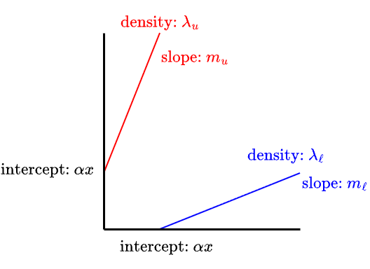
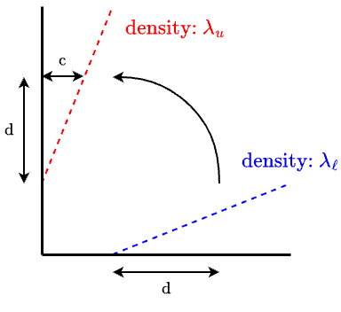
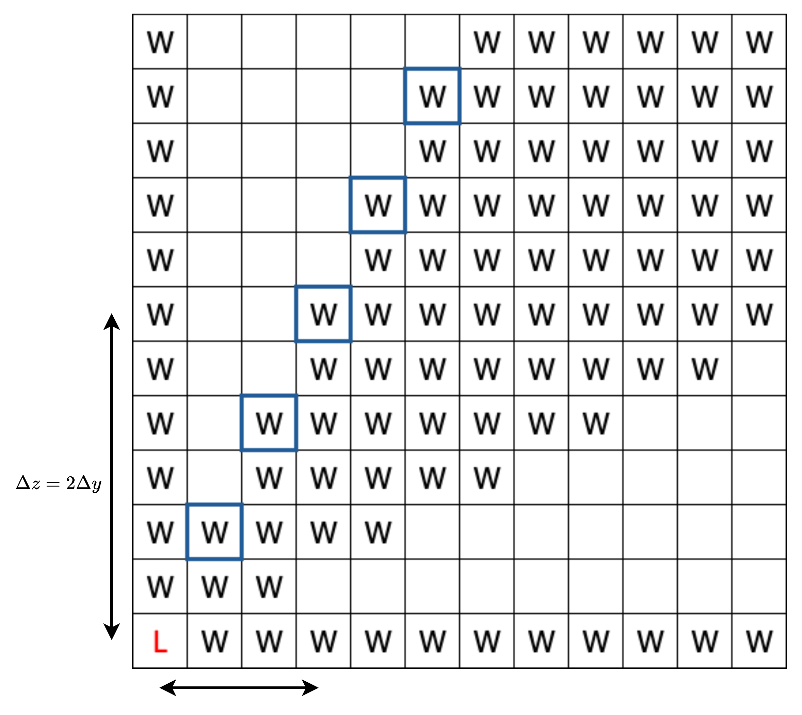

# Bounded Wythoff Analysis (Pt. 3)
## Recursive Operator
### Goal: Find $W_{x+1}$ from $W_x$
We may start by expressing $W_x$ as the parents of all lower level losers: \
$W_x = P_x(L_0)+P_x(L_1)+P_x(L_2)+\dots+P_x(L_{x-1})$ where:
- $W_x$ is the sheet of instant winners on level x. 
- $L_k$ is the sheet of losers on level k.
- The $P_x$ operator finds all the parents on level x.
- If we have a loser on level $k$ then the difference in levels is $x-k$.

#### Moves that change x-level:
- Removing chips from only pile x: 
$[x-t,y,z]$

- Removing chips from piles x and y: 
$[x-s,y-t,z]$ with $\frac{1}{2} \le \frac{s}{t} \le 2$ and $s,t \ge 1$

- Removing chips from piles x and z: 
$[x-s,y,z-t]$ with $\frac{1}{2} \le \frac{s}{t} \le 2$ and $s,t \ge 1$
\
\
Because the "normal nim x" move leaves $y$ and $z$ unchanged, if $L_k(y,z)$ is a loser, then $W_x(y,z)$ is an instant winner.

Moving down $x-k$ levels means removing $x-k$ from pile x, so piles y and z may have anywhere from $\lceil{\frac{x-k}{2}}\rceil$ to $2(x-k)$ chips removed. 

Therefore, $W_x$ is a winner if $L_k(y-t,z)$ or $L_k(y,z-t)$ are losers for $\lceil{\frac{x-k}{2}}\rceil \le t \le 2(x-k)$.

*The red winner is from removing only from $x$, the blue is from removing from $x$ and $y$, and green is from removing from $x$ and $z$.*

For every level that we go up, we "extend" parents of losers horizontally ($+y$ direction) and vertically ($+z$ direction). If the difference in levels is $x-k$, then the extension will be from $\lceil{\frac{x-k}{2}}\rceil$ to $2(x-k)$ cells up or to the right from the loser. 

### Attempt 1: No auxiliary sheets
To express the "extensions" of losers, we can define an operator $\mathcal{S}_\mathcal{d}$ where $d$ is difference in levels $x-k$ and acts upon a loser sheet to make extensions horizontally and vertically for all losers.
$$\mathcal{S}_\mathcal{d}L_k(y,z) = \sum\limits_{t=\lceil{d/2}\rceil}^{2d}{L_k(y-t,z)+L_k(y,z-t)}$$

Recall that the parents of losers also includes the loser itself, but on the higher level due to the "normal nim x" move, which contributes $L_k$ to $W_x$. 

Thus, $P_x(L_k)=L_k+\mathcal{S}_{x-k}L_k$.

So in total, the contributions from all lower loser sheets to a winner sheet $W_x$ is:
$$W_x=\sum\limits_{k=0}^{x-1}{L_k+\mathcal{S}_{x-k}L_k}$$

However, using this form, $W_{x+1}$ cannot be written in terms of $W_x$ alone.

$$W_{x+1} = \sum_{k=0}^{x} \big(L_k + \mathcal{S}_{x+1-k}L_k\big)$$
Taking out the last term of index $x$ gives us:
$$W_{x+1} = \underbrace{\big(L_x + \mathcal{S}_1(L_x)\big)}_{\text{new sheet } x} + \sum_{k=0}^{x-1} \big(L_k + \mathcal{S}_{x+1+k}L_k\big)$$

Notice that the sum portion is identical to $W_x$ but every $\mathcal{S}_d$ is now $\mathcal{S}_{d+1}$.

The problem with this is that for every step up, the farther edge of the extension moves from $2d \to 2d+2$, while the closer edge moves from $\lceil d/2 \rceil \to \lceil (d{+}1)/2 \rceil$ which stays the same when $d$ is odd, but increases by one if $d$ is even. 

We cannot express $\mathcal{S}_{d+1}$ in terms of $\mathcal{S}_d$ cleanly. A position in $W_x$ doesn't remember which loser generated it so we don't know if it should grow and in which direction. The $\mathcal{S}_d$ operator will extend both up and to the right of any marked position, instead of just from losers or only up/right.

### Attempt 2: Separating "extension" operators
We can try separating the $\mathcal{S}_d$ operator into its horizontal and vertical components:
We introduce the $\mathcal{H}$ and $\mathcal{V}$ operators, standing for horizontal and vertical shifts. 

The horizontal shifter $\mathcal{H}$ will move a sheet to the right by one spot, where $\mathcal{H}A(y,z)=A(y-1,z)$.

The vertical shifter $\mathcal{V}$ will move a sheet up by one spot, where $\mathcal{V}A(y,z)=A(y,z-1)$.

Writing it out and finding a general formula for $W_x$ using this method:

*The underlined blue parts are difference between $W_x$ and $W_{x+1}$.*

This encounters a similar issue where applying a horizontal or vertical shift to $W_x$ will lead to unintended parts being shifted, namely the vertical parts being shifted horizontally and vice versa. This would lead to parents being found through a "diagonal" move which is not allowed. Also, it would depend on the difference being even or odd.

### So we need auxiliary sheets:
We use auxiliary sheets to calculate the contributions of moves separately. 

We find the change in sheets that only contain parents from a certain move while going up x-levels, and then to get $W_x$, we sum the contributions up:

$\boxed{W_{x+1}=V^1_{x+1}+V^2_{x+1}+V^3_{}x+1}$

We introduce three auxiliary sheets ($V^1,V^2,V^3$), one for each move.\
$V^1$ are the instant winners that can reach a loser by only removing from $x$, $V^2$ are the winners that can reach losers by only removing from $x$ and $y$, and $V^3$ are winers that can reach losers by only removing from $x$ and $z$.

- "Normal nim x" move: 
  $\boxed{V^1_{x+1}=V^1_x+L_x}$
  

  
<b>Click to view the image</b>

  
  
  *To find a recursive operator that acts on $V^1$, it's just the standard nim recursive operator. Since we are moving straight down to loser sheets, the (y,z) coordinates won't change so we only need to add the current losers $L_x$ to every other lower loser, which is already accounted for from $V^1_x$. So, $V^1_{x+1} = V^1_x + L_x$.*
  

 

- Removing from $x$ and $y$: 
  $\boxed{V^2_{x+1} = \mathcal{S}_y(V^2_x + L_x) + S^2_y(V^2_x + L_x) + \mathcal{S}_y(V^2_{x-1} + L_{x-1})}$
  

  
<b>Click to view the image</b>

  
  *To find a recursive operator that acts on $V^2$, we need to find a way to expand that horizontal line that starts at a loser. Every time we go up a level, that horizontal line's left endpoint should increase by 1 every 2 levels, while the right endpoint should increase by 2 every level.*
  

 

- Removing from $x$ and $z$: 
  $\boxed{V^3_{x+1} = \mathcal{S}_z(V^3_x + L_x) + S^2_z(V^3_x + L_x) + \mathcal{S}_z(V^3_{x-1} + L_{x-1})}$

  This will be identical to $V^2$ but instead of horizontal, it is extending vertically.

## Supermex Operator
The supermex operator concerns how we can find the losers from the same-level instant winner sheet. 

#### Moves that don't change x-level:

- Removing chips from only pile y: 
$[x,y-t,z]$

- Removing chips from only pile z: 
$[x,y,z-t]$

- Removing chips from piles y and z: 
$[x,y-s,z-t]$ with $\frac{1}{2} \le \frac{s}{t} \le 2$ and $s,t \ge 1$

All valid moves must decrease the **lexicographic order:**

&emsp; $(x,y,z) \rightarrow (x',y',z')$ where one of the following are true:
- $x'<x$
- $x'=x$ and $y'<y$
- $x'=x$ and $y'=y$ and $z'<z$

### Finding parents on the graph
This means that we find the first available loser by scanning column by column (least to greatest $y$ coordinates), and within each column scanning upwards (least to greatest $z$ coordinates) until we find the first non-winner position.

Then from that loser, we mark all positions with a higher $z$ only, a higher $y$ only, and positions that we can reach by adding chips in a $1\!:\!2$ to $2\!:\!1$ ratio. This turns out to be a cone with upper slope $2$ and bottom slope $\frac{1}{2}$. 

  
<b>Click to view the image</b>

  

 

We continue to find the next loser, which must be in the next column and scan upwards to fill another cone. 

  
<b>Click to view the image</b>

  

 

And repeat until we fill the whole grid. 

  
<b>Click to view the image</b>

  

 

Since losers block off the entire column and row that they are in, there is exactly one loser in each row/column. 

## Geometry

### First observations
We can notice that the game is completely symmetrical across all three axes, since there is no difference between the $x,y,z$ piles. 

This means that the graphs are symmetrical across the $45 \degree y/z$ diagonal (as well as $x/y$ and $x/z$ which is less visible in 2D sheets).

Additionally, we spot two loser lines, which we will call the "upper loser line" and "lower loser line", with their slopes being inverses of each other. These loser lines lie on the outer boundary of the instant winner sheet geometries. There is also a region near the origin with three regions of losers. 
As we move up in x-values, the shape of the sheets stays roughly the same, while the size just increases. 

Because the game is symmetrical, we can figure out the coordinates of the losers at $y=0$ or $z=0$. When $y=0$, it is basically the two-pile game with piles $x$ and $z$. When $z=0$, it is the two-pile game with $x$ and $y$. These losers will be the same as the losers at $x=0$, which is the two-pile game with piles $y$ and $z$. 

For example, from the $L_0$ sheet we can see that there are losers with $x=0$ at $(1,3),(2,6),(3,1),(4,11)\ldots$\
This means that on $L_1$, there are losers at $(3,0)$ and $(0,3)$. On $L_2$, there are losers at $(6,0)$ and $(0,6)$. On $L_3$, there are losers at $(1,0)$ and $(0,1)$, and so on. 

## Renormalization
We would like to find values that characterize the geometry of losers. From before, we see that there are two loser lines. We can assign each line a slope and density. The upper line has slope $m_u$ and density $\lambda_u$, while the lower line has slope $m_\ell$ and density $\lambda_\ell$. Since they are mirrored across the diagonal, we can assign one y-intercept/z-intercept value that scales with x-level, $\alpha$.

### Equations
First we look at four variables, $\lambda_u,\lambda_\ell,m_u,m_\ell$, and find four equations relating them to solve.

We know that there is exactly one loser in any column or row, and we define density as the number of dots on a line (upper or lower) per number of columns. Therefore, the two densities must sum to 1:
$$\boxed{\lambda_u+\lambda_\ell=1}$$

Since the game is symmetric across the $45\degree$ diagonal, the two lines are reflections of each other and their slopes are inverses:
$$\boxed{m_\ell = \frac{1}{m_u}}$$

#### Relating the densities to the slopes

Counting the losers along the two lines gives a relation between the densities and the slope. A horizontal stretch $d$ measured along the lower line contains $\lambda_\ell\mkern1mu d$ losers, and if we mirror this region to the upper line, the matching horizontal stretch $c$ along the upper line contains $\lambda_u\mkern1mu c$ losers. So, we have the same number of losers in $\lambda_u\mkern1mu d$ as in $\lambda_u\mkern1mu c$.

$$\lambda_u\mkern1mu c = \lambda_\ell\mkern1mu d \qquad\Longrightarrow\qquad \frac{\lambda_u}{\lambda_\ell} = \frac{d}{c} = m_u.$$
$$\boxed{\frac{\lambda_u}{m_u}=\lambda_\ell}$$

Our fourth equation comes from looking at supermex. It comes from asking how far apart consecutive losers on the upper line have to be. We are trying to figure out how we can generalize getting from one loser to another loser on the same line (we will focus on the upper line for convenience). 

When we move from a loser $(y,z)$ to an implied winner, we know that the implied winner with highest possible $z$ (that is a parent of this specific loser) is of the form $(y+\Delta y,z+2\Delta y)$. This is because if we removed $\Delta y$ chips from $y$ from a winning position, then we can remove a maximum of $2\Delta y$ from $z$. Recall the two-pile move lands anywhere in a "cone" opening to the right, bounded by slope $\tfrac{1}{2}$ below and slope $2$ above (removing chips in a $1\!:\!2$ to $2\!:\!1$ ratio). 

To find the next consecutive loser on the upper line, it has to be above that cone, so at $(y+\Delta y, z + 2\Delta y+1)$. So over a run of $\Delta y$ columns, the rise in $z$ is $2\Delta y$ to reach the top loser in the column, plus one extra cell for each loser we passed along the way. *This is assuming that we do not have lower level losers that will force the next loser to increase in $z$ by 1.  If we go across $\Delta y$, then the number of upper-line losers passed would just be $\lambda_u(\Delta y)$, so:
$$\Delta z = 2\Delta y + (\text{\# of losers passed})$$
$$\Delta z = 2\Delta y + (\lambda_u \mkern1mu \Delta y)$$
$$\Delta z = \Delta y(2+\lambda_u)$$
$$\frac{\Delta z}{\Delta y} = 2+ \lambda_u$$
$$\boxed{m_u = 2+\lambda_u}$$

### Solving the equations
To recap, we have four equations:
$$\begin{equation}
    \lambda_u+\lambda_\ell=1
\end{equation}$$
$$\begin{equation}
    m_\ell = \frac{1}{m_u}
\end{equation}$$
$$\begin{equation}
    \frac{\lambda_u}{m_u}=\lambda_\ell
\end{equation}$$
$$\begin{equation}
    m_u = 2+\lambda_u
\end{equation}$$

We can substitute $(3)$ into $(1)$:
$$\lambda_u + \frac{\lambda_u}{m_u}=1$$
$$\lambda_u\left(1+\frac{1}{m_u}\right)=1$$
$$\lambda_u=\frac{1}{1+\frac{1}{m_u}}$$
$$\begin{equation}
\lambda_u=\frac{m_u}{m_u+1}
\end{equation}$$

Then we can use this equation $(5)$ and substitute it into $(4)$:
$$\lambda_u = \frac{m_u}{m_u + 1} \qquad\text{and}\qquad m_u = 2 + \lambda_u$$
$$\lambda_u=\frac{2+\lambda_u}{3+\lambda_u}$$
$$\lambda_u(3 + \lambda_u) = 2 + \lambda_u$$
$$\lambda_u^2 + 2\lambda_u - 2 = 0$$

The quadratic formula gives $\lambda_u = \dfrac{-2 \pm \sqrt{4 + 8}}{2} = -1 \pm \sqrt{3}$, and we take the positive root because density is positive:
$$\boxed{\lambda_u = \sqrt{3} - 1} \approx 0.732$$
Now that we have one unknown solved, we can find the rest easily:
$$m_u = 2 + \lambda_u$$
$$\boxed{m_u = 1 + \sqrt{3}} \approx 2.732$$
$$m_\ell = \frac{1}{m_u}$$
$$m_\ell = \frac{1}{1 + \sqrt{3}} $$
$$\boxed{m_\ell = \frac{\sqrt{3} - 1}{2}} \approx 0.366$$
$$\lambda_u+\lambda_\ell = 1$$
$$\lambda_\ell = 1 - \lambda_u$$
$$\lambda_\ell = 1 - \sqrt{3} - 1$$
$$\boxed{\lambda_\ell = 2 - \sqrt{3}} \approx 0.268$$

### Actual geometry
These four values are found under the assumption that there is no "bumping up" from loser level loser sheets. That is when there is a loser position already occupied by a lower level loser. The lower level loser would be reachable through a "normal nim x" move, since simply removing chips from the $x$ pile would reach the loser. Since losers may not reach losers, the position on $L_x$ must be some sort of winner and the actual loser would have its $z$ increased by one. 

When we look at the actual geometry of the sheets higher than $x=0$, we find that the lines form an asymptote. 

The actual slope starts out steeper, and approaches 

