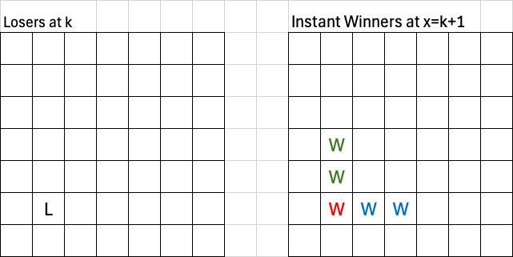
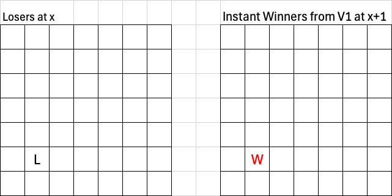
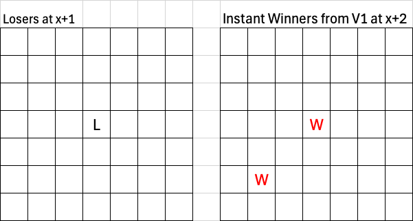
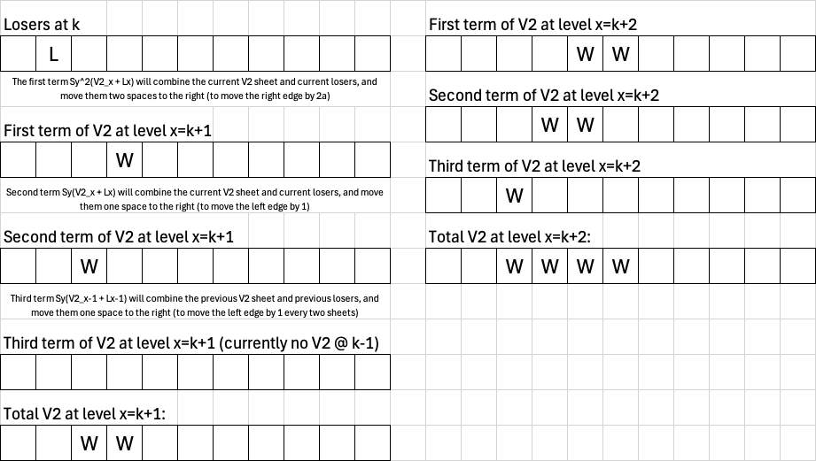
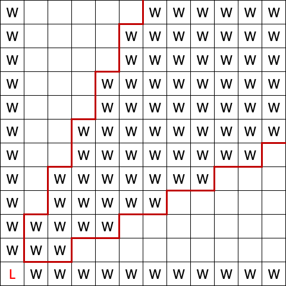
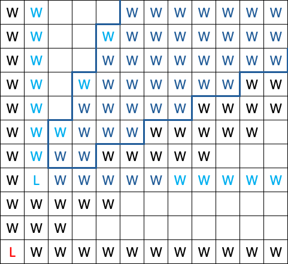
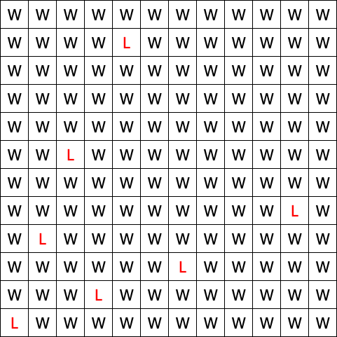
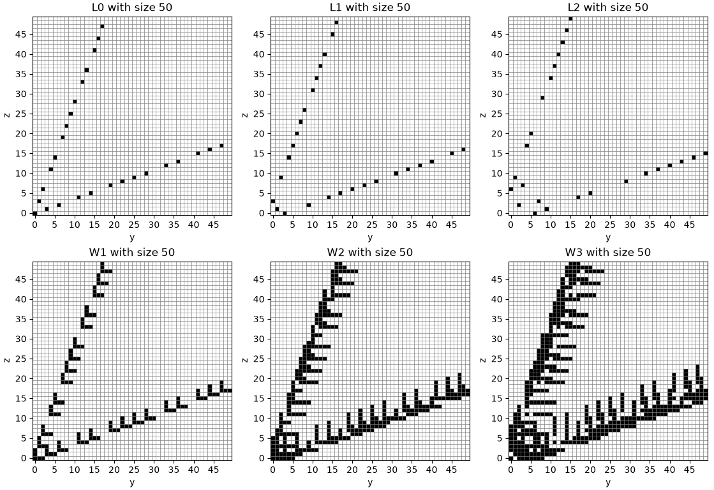
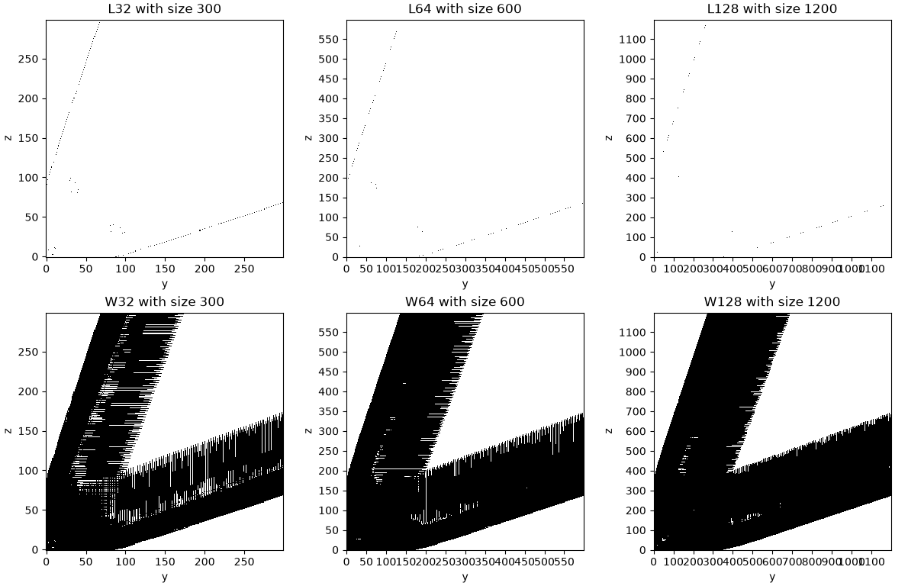

# Bounded Wythoff Analysis (Pt. 3)
## Recursive Operator
### Goal: Find $W_{x+1}$ from $W_x$
We may start by expressing $W_x$ as the parents of all lower level losers: \
$W_x = P_x(L_0)+P_x(L_1)+P_x(L_2)+\dots+P_x(L_{x-1})$ where:
- $W_x$ is the sheet of instant winners on level x. 
- $L_k$ is the sheet of losers on level k.
- The $P_x$ operator finds all the parents on level x.
- If we have a loser on level $k$ then the difference in levels is $x-k$.

#### Moves that change x-level:
- Removing chips from only pile x: 
$[x-t,y,z]$

- Removing chips from piles x and y: 
$[x-s,y-t,z]$ with $\frac{1}{2} \le \frac{s}{t} \le 2$ and $s,t \ge 1$

- Removing chips from piles x and z: 
$[x-s,y,z-t]$ with $\frac{1}{2} \le \frac{s}{t} \le 2$ and $s,t \ge 1$
\
\
Because the "normal nim x" move leaves $y$ and $z$ unchanged, if $L_k(y,z)$ is a loser, then $W_x(y,z)$ is an instant winner.

Moving down $x-k$ levels means removing $x-k$ from pile x, so piles y and z may have anywhere from $\lceil{\frac{x-k}{2}}\rceil$ to $2(x-k)$ chips removed. 

Therefore, $W_x$ is a winner if $L_k(y-t,z)$ or $L_k(y,z-t)$ are losers for $\lceil{\frac{x-k}{2}}\rceil \le t \le 2(x-k)$.

*The red winner is from removing only from $x$, the blue is from removing from $x$ and $y$, and green is from removing from $x$ and $z$.*

For every level that we go up, we "extend" parents of losers horizontally ($+y$ direction) and vertically ($+z$ direction). If the difference in levels is $x-k$, then the extension will be from $\lceil{\frac{x-k}{2}}\rceil$ to $2(x-k)$ cells up or to the right from the loser. 

### Attempt 1: No auxiliary sheets
To express the "extensions" of losers, we can define an operator $\mathcal{S}_\mathcal{d}$ where $d$ is difference in levels $x-k$ and acts upon a loser sheet to make extensions horizontally and vertically for all losers.
$$\mathcal{S}_\mathcal{d}L_k(y,z) = \sum\limits_{t=\lceil{d/2}\rceil}^{2d}{L_k(y-t,z)+L_k(y,z-t)}$$

Recall that the parents of losers also includes the loser itself, but on the higher level due to the "normal nim x" move, which contributes $L_k$ to $W_x$. 

Thus, $P_x(L_k)=L_k+\mathcal{S}_{x-k}L_k$.

So in total, the contributions from all lower loser sheets to a winner sheet $W_x$ is:
$$W_x=\sum\limits_{k=0}^{x-1}{L_k+\mathcal{S}_{x-k}L_k}$$

However, using this form, $W_{x+1}$ cannot be written in terms of $W_x$ alone.

$$W_{x+1} = \sum_{k=0}^{x} \big(L_k + \mathcal{S}_{x+1-k}L_k\big)$$
Taking out the last term of index $x$ gives us:
$$W_{x+1} = \underbrace{\big(L_x + \mathcal{S}_1(L_x)\big)}_{\text{new sheet } x} + \sum_{k=0}^{x-1} \big(L_k + \mathcal{S}_{x+1+k}L_k\big)$$

Notice that the sum portion is identical to $W_x$ but every $\mathcal{S}_d$ is now $\mathcal{S}_{d+1}$.

The problem with this is that for every step up, the farther edge of the extension moves from $2d \to 2d+2$, while the closer edge moves from $\lceil d/2 \rceil \to \lceil (d{+}1)/2 \rceil$ which stays the same when $d$ is odd, but increases by one if $d$ is even. 

We cannot express $\mathcal{S}_{d+1}$ in terms of $\mathcal{S}_d$ cleanly. A position in $W_x$ doesn't remember which loser generated it so we don't know if it should grow and in which direction. The $\mathcal{S}_d$ operator will extend both up and to the right of any marked position, instead of just from losers or only up/right.

### Attempt 2: Separating "extension" operators
We can try separating the $\mathcal{S}_d$ operator into its horizontal and vertical components:
We introduce the $\mathcal{H}$ and $\mathcal{V}$ operators, standing for horizontal and vertical shifts. 

The horizontal shifter $\mathcal{H}$ will move a sheet to the right by one spot, where $\mathcal{H}A(y,z)=A(y-1,z)$.

The vertical shifter $\mathcal{V}$ will move a sheet up by one spot, where $\mathcal{V}A(y,z)=A(y,z-1)$.

Writing it out and finding a general formula for $W_x$ using this method:

*The underlined blue parts are difference between $W_x$ and $W_{x+1}$.*

This encounters a similar issue where applying a horizontal or vertical shift to $W_x$ will lead to unintended parts being shifted, namely the vertical parts being shifted horizontally and vice versa. This would lead to parents being found through a "diagonal" move which is not allowed. Also, it would depend on the difference being even or odd.

### So we need auxiliary sheets:
We use auxiliary sheets to calculate the contributions of moves separately. 

We find the change in sheets that only contain parents from a certain move while going up x-levels, and then to get $W_x$, we sum the contributions up:

$\boxed{W_{x+1}=V^1_{x+1}+V^2_{x+1}+V^3_{}x+1}$

We introduce three auxiliary sheets ($V^1,V^2,V^3$), one for each move.\
$V^1$ are the instant winners that can reach a loser by only removing from $x$, $V^2$ are the winners that can reach losers by only removing from $x$ and $y$, and $V^3$ are winers that can reach losers by only removing from $x$ and $z$.

- "Normal nim x" move: 
  $\boxed{V^1_{x+1}=V^1_x+L_x}$
  

  
<b>Click to view the image</b>

  
  
  *To find a recursive operator that acts on $V^1$, it's just the standard nim recursive operator. Since we are moving straight down to loser sheets, the (y,z) coordinates won't change so we only need to add the current losers $L_x$ to every other lower loser, which is already accounted for from $V^1_x$. So, $V^1_{x+1} = V^1_x + L_x$.*
  

 

- Removing from $x$ and $y$: 
  $\boxed{V^2_{x+1} = \mathcal{S}_y(V^2_x + L_x) + S^2_y(V^2_x + L_x) + \mathcal{S}_y(V^2_{x-1} + L_{x-1})}$
  

  
<b>Click to view the image</b>

  
  *To find a recursive operator that acts on $V^2$, we need to find a way to expand that horizontal line that starts at a loser. Every time we go up a level, that horizontal line's left endpoint should increase by 1 every 2 levels, while the right endpoint should increase by 2 every level.*
  

 

- Removing from $x$ and $z$: 
  $\boxed{V^3_{x+1} = \mathcal{S}_z(V^3_x + L_x) + S^2_z(V^3_x + L_x) + \mathcal{S}_z(V^3_{x-1} + L_{x-1})}$

  This will be identical to $V^2$ but instead of horizontal, it is extending vertically.

## Supermex Operator
The supermex operator concerns how we can find the losers from the same-level instant winner sheet. 

#### Moves that don't change x-level:

- Removing chips from only pile y: 
$[x,y-t,z]$

- Removing chips from only pile z: 
$[x,y,z-t]$

- Removing chips from piles y and z: 
$[x,y-s,z-t]$ with $\frac{1}{2} \le \frac{s}{t} \le 2$ and $s,t \ge 1$

All valid moves must decrease the **lexicographic order:**

&emsp; $(x,y,z) \rightarrow (x',y',z')$ where one of the following are true:
- $x'<x$
- $x'=x$ and $y'<y$
- $x'=x$ and $y'=y$ and $z'<z$

### Finding parents on the graph
This means that we find the first available loser by scanning column by column (least to greatest $y$ coordinates), and within each column scanning upwards (least to greatest $z$ coordinates) until we find the first non-winner position.

Then from that loser, we mark all positions with a higher $z$ only, a higher $y$ only, and positions that we can reach by adding chips in a $1\!:\!2$ to $2\!:\!1$ ratio. This turns out to be a cone with upper slope $2$ and bottom slope $\frac{1}{2}$. 

  
<b>Click to view the image</b>

  

 

We continue to find the next loser, which must be in the next column and scan upwards to fill another cone. 

  
<b>Click to view the image</b>

  

 

And repeat until we fill the whole grid. 

  
<b>Click to view the image</b>

  

 

Since losers block off the entire column and row that they are in, there is exactly one loser in each row/column. 

## Overall Geometry

We can notice that there are two 